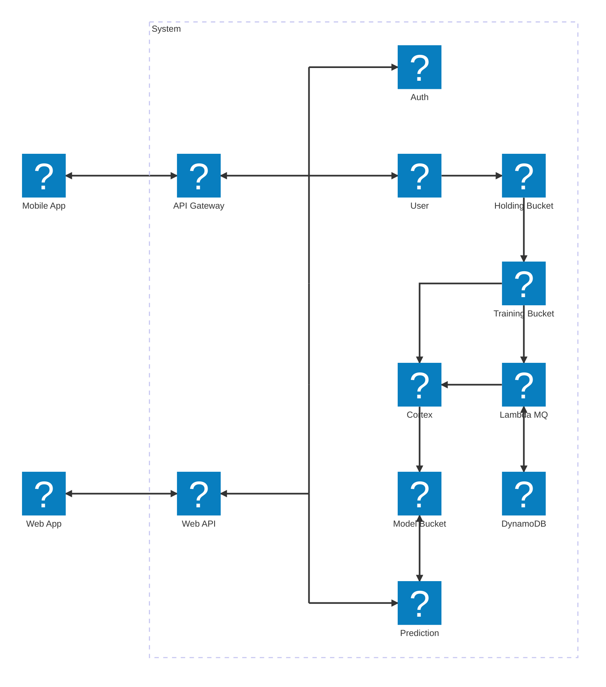

# Picipedia Cortex
The Cortex Kubeflow pipeline for the Picipedia project, containing an incremental CNN.

## Architecture

```mermaid
architecture-beta
    group system[System]

    %% Frontend declarations
    service mobile(mdi:cellphone)[Mobile App]
    service desktop(mdi:desktop-windows)[Web App]

    %% Proxy service declarations
    service webapi(mdi:internet)[Web API] in system
    service gateway(mdi:boom-gate)[API Gateway] in system

    %% Junction declarations
    junction jun1 in system
    junction jun2 in system
    junction jun3 in system
    junction jun4 in system
    junction jun5 in system
    junction jun6 in system

    %% Custom service declarations
    service auth(mdi:key)[Auth] in system
    service user(mdi:user)[User] in system
    service cort(mdi:brain)[Cortex] in system
    service pred(mdi:magnify)[Prediction] in system
    
    %% AWS service declarations
    service lambda(logos:aws-lambda)[Lambda MQ] in system
    service s3-model(logos:aws-s3)[Model Bucket] in system
    service s3-hold(logos:aws-s3)[Holding Bucket] in system
    service s3-train(logos:aws-s3)[Training Bucket] in system
    service dynamo-db(logos:aws-dynamodb)[DynamoDB] in system

    %% Frontend mappings
    desktop:R <--> L:webapi
    mobile:R <--> L:gateway
    
    %% Proxy service mappings
    jun1:B -- T:jun2
    jun2:B -- T:jun3
    gateway:R <-- L:jun2
    jun3:B -- T:jun4
    webapi:R <-- L:jun5
    jun5:T -- B:jun4
    jun6:T -- B:jun5

    %% Edge service mappings
    jun1:R --> L:auth
    jun2:R --> L:user
    jun6:R --> L:pred

    %% User service mappings
    user:R --> L:s3-hold
    s3-hold:B --> T:s3-train

    %% Training bucket mappings
    s3-train:B --> T:lambda
    s3-train:L --> T:cort

    %% Lambda service mappings
    lambda:L --> R:cort
    lambda:B <--> T:dynamo-db

    %% Cortex service mappings
    cort:B --> T:s3-model
    s3-model:B <--> T:pred
```
